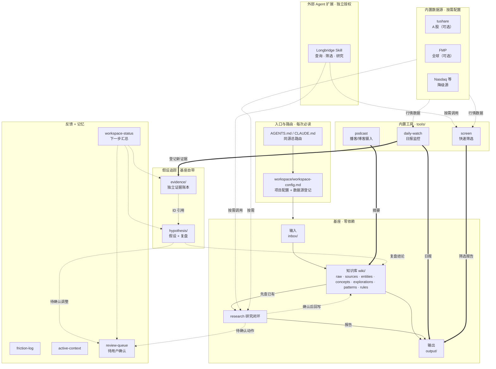

# 系统架构 · AI Workspace Hub

> 截至 2026-07-20（v0.7.0）。给"想看懂这套系统怎么搭"的人看的参照图，不是每次必读文件。
> 一句话：**一个 all-in-one AI 研究工作系统——六大能力开箱即用，数据源按需配置，零 key 也能跑。**

---

## 架构图



### 怎么读这张图

- **实线** = 主数据流。
- **粗箭头 `==>`** = 工具写入基座。
- **虚线** = 反馈 / 回写 / 可选连接。
- **基座(BASE)零依赖**：clone 下来立刻能跑 `inbox → wiki → output` + research。
- **内置工具(TOOLS)**：代码在 `tools/` 下，首次使用时 agent 用 `python3 -m pip install ...` 安装依赖；若环境只有 `python`，则替换成 `python -m pip ...`。
- **数据源(DATA)**：配了才用，没配降级不报错。

---

## 六大能力

| 能力 | 类型 | Skill 文件 | 代码 | 依赖 |
|------|------|-----------|------|------|
| 个人 wiki | 基座 | `system/integrations/personal-wiki.md` | markdown 读写 | 无 |
| 研究闭环 | 基座 | `system/skills/research.md` | markdown + websearch | 无 |
| 快速筛选 | 基座 | `system/skills/screen.md` | agent 驱动 + 可选 API | 无 |
| 假设追踪 | 基座 | `system/integrations/hypothesis-tracker.md` | markdown 读写 | 无 |
| 播客摄入 | 工具 | `system/skills/podcast.md` | `tools/podcast/scripts/` | Python + LLM key |
| 日报监控 | 工具 | `system/skills/daily-watch.md` | `tools/daily-watch/scripts/` | Python + 可选 API |

---

## 数据源

| 数据源 | 市场 | 费用 | 用于 |
|--------|------|------|------|
| tushare | A 股 (.SH/.SZ) | 按官方套餐 | daily-watch, screen, research |
| FMP | 全球 | 按官方套餐 | daily-watch, screen, research |
| Nasdaq / Finnhub / EOD / yfinance | 各自覆盖市场 | 各自规则 | daily-watch 降级源 |
| websearch | — | Agent 自带 | 全部能力的兜底 |
| Longbridge Skill | 以官方支持范围为准 | 独立安装与授权 | screen, research 外部扩展 |

日报脚本按市场使用 tushare / FMP，并在缺失或请求失败时尝试 Nasdaq、Finnhub、EOD、yfinance。零 Key 时仍生成报告骨架，Agent 可用 websearch 补充；Longbridge 不在日报脚本调用链中。

---

## 目录结构

```text
ai-workspace-hub/
│
├── AGENTS.md / CLAUDE.md           # 入口：总路由（同源）
├── ARCHITECTURE.md                 # 本文件
├── README.md                       # 门面
├── INSTALL-FOR-AI.md               # AI agent 安装协议
├── SMOKE-TEST.md                   # 装完自检
├── requirements.txt                # 合并依赖
├── requirements-pdf.txt            # PDF 可选依赖
│
├── config/                         # 用户配置（不入 git）
│
├── tools/                          # 内置工具
│   ├── podcast/                    #   播客/博客摄入
│   │   ├── scripts/                #     Python 脚本
│   │   ├── examples/               #     默认配置模板
│   │   └── .env.example            #     LLM key 模板
│   └── daily-watch/                #   日报监控
│       ├── scripts/                #     Python 脚本
│       ├── config-examples/        #     配置模板
│       └── templates/              #     报告/假设 markdown 模板
│
├── workspace/
│   ├── workspace-config.md         # 项目配置
│   ├── research-profile.md         # 从真实研究校准的方法偏好
│   ├── review-queue.md             # 待用户确认的动作
│   ├── knowledge-usage.jsonl       # 实际调用的知识 ID（追加式记录）
│   └── meta/
│       ├── active-context.md       # 工作记忆
│       └── friction-log.md         # 摩擦日志
│
├── wiki/                           # 知识库
│   ├── _schema.md
│   ├── raw/ / sources/ / entities/ / concepts/
│   ├── explorations/               # 阶段判断卡 + 索引
│   ├── patterns/                   # 可迁移机制卡 + 索引
│   └── rules/                      # 可调用决策规则 + 索引
│
├── inbox/                          # 输入
├── output/                         # 输出（research/ screen/ pod2wiki/ 等子目录）
├── monitoring/                     # 用户阅读的监控看板
├── hypothesis/                     # 假设追踪与复盘
├── evidence/                       # 独立证据账本
├── daily-watchlist-reports/        # 日报输出
├── portfolio/                      # 交易记录
│
├── system/                         # 机器零件箱
│   ├── lib/                        #   共享运行库（LLM client）
│   ├── skills/                     #   能力说明书
│   ├── integrations/               #   内部接线说明
│   ├── interfaces/                 #   已启用工具总览
│   ├── scripts/                    #   基座脚本（安装 / 检查 / wiki_tagger / PDF）
│   └── templates/                  #   安装时复制的模板文件
│
└── _archive/                       # 归档区
```

---

## 完整闭环

```text
research ──► hypothesis ──► watchlist ──► daily-watch ──► evidence
    │             ▲                                      │
    │             └──────── 用户确认后的复盘 ──────────────┘
    └──► review-queue ──► wiki / hypothesis / watchlist / research-profile
```

基座保证 `inbox → wiki → output + research`。其余能力按配置渐进亮灯。

## Wiki 自动标签层

```text
note / PDF / podcast source
  -> system/scripts/wiki_tagger.py
  -> domain + ticker + concepts + related + entity_salience + tags
  -> entity / concept / exploration
```

所有入口共用 `system/lib/llm_client.py` 和同一套字段校验。摄入单文件时明确加 `--apply`；历史 `backfill` 默认只预览。打标器只补空字段，并用 `tagging.status: completed` 防止合法空值触发重复 API 调用。

## Research Preflight 层

```text
研究问题 + ticker + 结构关键词
  -> 加载 active Rule / Pattern / Exploration
  -> 扫描 Entity / Concept / Source
  -> 返回命中理由、摘要片段、过期/反方提示
  -> output/research/preflight/{R-ID}.md
  -> Agent 打开命中全文后再联网
```

`research_preflight.py` 读取 `workspace-config.md` 的 `wiki_root`，因此本地 Wiki 和外部 Wiki 使用同一入口。它是标准库本地扫描，不调用 LLM；复杂度与 Markdown 页数线性相关。默认不扫描 `raw/`，并限制知识卡和普通 Wiki 的返回数量，控制上下文成本。关键词命中只是召回，不能替代对否定语义、反例和来源质量的判断。

研究报告通过 `preflight_id / knowledge_used / wiki_pages_loaded` 引用扫描回执。这样“先查本地知识”从行为建议变成可验证步骤；扫描失败允许人工全文搜索降级，但必须在 `Wiki check` 留下失败原因和范围。

## 知识编译层

```text
raw → source → entity/concept → exploration → pattern → rule
                                             └→ false belief（被证伪且易复发）
```

`knowledge_lifecycle.py` 维护三类短索引，并按当前研究 context 选择性加载。加载顺序是 `rule -> pattern -> exploration`；默认排除 draft、weakened、invalidated、retired、deprecated 和 archived。详细证据不进索引，实际命中的知识 ID 追加到 `workspace/knowledge-usage.jsonl`，避免 wiki 越大、每次上下文越重。

exploration 验证、pattern 新建/合并、rule 晋级、降级和退役都先进 `workspace/review-queue.md`。Pattern 先满足两个独立 exploration 和两个 primary 确认，Rule 再满足三个独立案例、scope 与失效信号；脚本只执行合法迁移，最终状态仍需用户确认。

---

## 文件归属与升级边界

Hub 用 `system/managed-files.json` 记录三类文件，安装时在
`workspace/.hub-state.json` 记录来源版本和安装方式，并用于升级预览与迁移。
`system/scripts/upgrade_workspace.py` 默认只预览差异；加 `--apply-managed` 才会更新 Hub 管理文件，并先备份旧版本。迁移清单可以创建缺失的新目录或空白模板，但绝不覆盖同名用户文件；混合文件只列为人工合并。

| 类型 | 典型路径 | 升级规则 |
|------|----------|--------------|
| Hub 管理 | `system/`、`tools/`、依赖清单 | 展示差异后可以更新 |
| 用户所有 | `wiki/`、`config/`、`output/`、`hypothesis/`、`evidence/`、`portfolio/` 等 | 永不自动覆盖 |
| 混合文件 | Agent 入口、`wiki/_schema.md`、`workspace/workspace-config.md` | 保留本地修改，只提示合并 |

## 状态层

系统不引入数据库。Markdown 继续作为可读、可编辑的主存储，但使用统一 frontmatter 和稳定 ID 解决跨文件关联：

- 研究 `RYYYYMMDD-NN`、假设 `Hn`、证据 `E-*`、待确认动作 `Q-*` 创建后不改 ID。
- frontmatter 是当前状态唯一来源，正文只保存论证和历史日志。
- `config/daily-watchlist-watchlist.md` 是唯一执行股票池；`monitoring/` 是展示层。
- `workspace/review-queue.md` 保存不能自动生效的动作。
- `system/scripts/workspace_status.py` 汇总进行中研究、开放假设、待复盘证据、到期复盘和待确认动作。

<!-- 文件说明：系统架构、能力分层和目录关系说明。 -->
