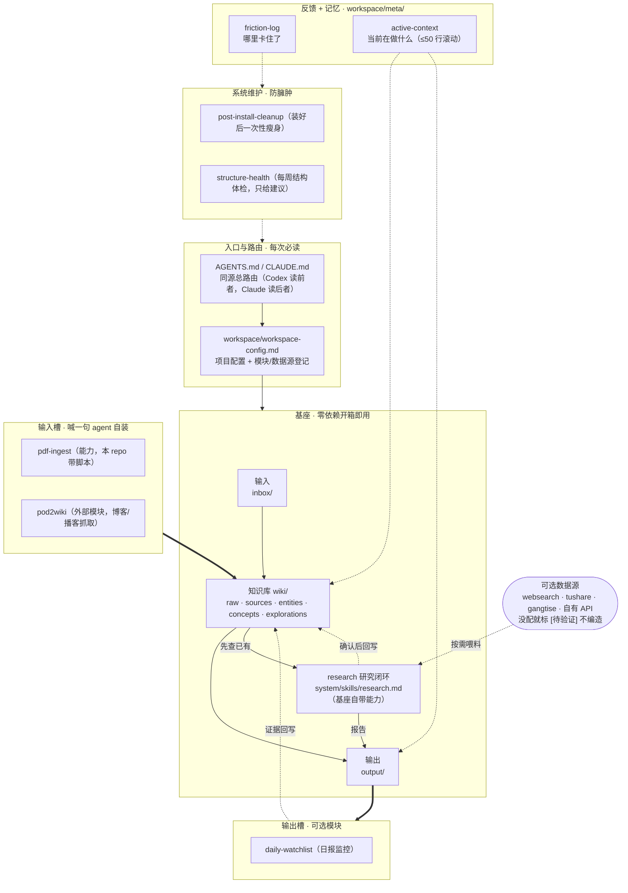

# 系统架构 · AI Workspace Hub

> 截至 2026-06-07（机械零件已收进 `system/`）。这是给"想看懂这套系统怎么搭"的人看的参照图，不是每次必读文件。
> 一句话：**一个零依赖的最小基座（输入 → 知识库 → 输出 → 反馈 + 记忆），两侧留槽位，想要更多喊一句 agent 自装。**

---

## 架构图：基座 + 槽位 + 维护



### 怎么读这张图

- **实线** = 主数据流（输入 → 知识库 → 输出）。
- **粗箭头 `==>`** = 槽位接进基座的入口。
- **虚线** = 反馈 / 记忆 / 回写等旁路。
- **基座(BASE)整块零依赖**：只要有 Codex / Claude，clone 下来立刻能跑 `inbox → wiki → output`，外加自带的 research 研究闭环。
- **槽位(INSLOT/OUTSLOT)和数据源(DS)都是可选的**：不预装、不预配环境，喊一句 agent 读对应 skill 自己装。
- **维护层(MAINT)** 把"防臃肿"做成可执行：瘦身清安装脚手架，周体检防再变胖，建议回流到入口文件。

---

## 四层分工（同一张图换个角度）

| 层 | 是什么 | 文件 | 依赖 |
|---|---|---|---|
| **入口/路由** | 告诉 agent 读哪写哪 | `AGENTS.md`·`CLAUDE.md`·`workspace/workspace-config.md` | 无 |
| **基座** | 输入·知识库·输出·研究闭环 | `inbox/`·`wiki/`·`output/`·`system/skills/{first-ingest,research}.md` | 无（零依赖） |
| **反馈+记忆** | 卡点日志 + 工作记忆 | `workspace/meta/{friction-log,active-context}.md` | 无 |
| **槽位/数据源** | 想要才加的能力与模块 | `system/skills/`·`system/integrations/`·`system/scripts/` + config 登记 | 按需自装 |
| **维护** | 防臃肿 | `system/skills/{post-install-cleanup,structure-health}.md` | 无 |

---

## 文件夹结构图

```text
workspace-mvp-hub/
│
├── AGENTS.md                       # ← 入口：Codex 读这个（总路由，与 CLAUDE.md 同源）
├── CLAUDE.md                       # ← 入口：Claude Code 读这个
├── README.md                       # 门面：30 秒看懂 + 怎么试跑/扩展
├── ARCHITECTURE.md                 # 本文件：架构图 + 文件夹结构
├── INSTALL-FOR-AI.md               # 安装手册（agent 照此把基座装进新目录）
├── SMOKE-TEST.md                   # 装完自检脚本
├── requirements-pdf.txt            # 可选能力(pdf)的依赖，agent 首次用时自装
│
├── workspace/
│   ├── workspace-config.md         # ← 每次必读：项目配置 + 模块/数据源登记
│   └── meta/
│       ├── active-context.md       # 记忆：当前在做什么（≤50 行滚动）
│       └── friction-log.md         # 反馈：哪里卡住了
│
├── wiki/                           # 【知识库 · 基座核心】
│   ├── _schema.md                  #   分类规则（摄入前先读）
│   ├── raw/                        #   原始材料归档
│   ├── sources/                    #   单来源结构化摘要
│   ├── entities/                   #   公司/人/产品/项目档案
│   ├── concepts/                   #   可复用概念与框架
│   └── explorations/               #   跨来源综合判断（研究回写落点）
│
├── inbox/                          # 【输入 · 基座】临时丢进来的原始材料
│
├── output/                         # 【输出 · 基座】
│   ├── research/                   #   研究报告（research skill 落点）
│   ├── daily/                      #   基座态手动日报（模块未部署时）
│   └── …（first-ingest / pdf-ingest / pod2wiki 等各自子目录）
│
├── monitoring/                     # 【输出槽预留】监控对象（日报输入）
│   └── watchlist.md
│
├── hypothesis/                     # 【基座自带】假设/证据/复盘（research、复盘自动写入）
│   └── README.md
│
├── requirements-pdf.txt            # 可选能力(pdf)依赖，agent 首次用时自装
│
├── system/                         # 【机器零件箱】日常不用直接读，全是 agent 的机械
│   ├── skills/                     #   能力说明书：怎么用 + 怎么自装
│   │   ├── first-ingest.md         #     基座：笔记 → wiki
│   │   ├── research.md             #     基座：研究闭环（模板 + 五步循环）
│   │   ├── pdf-ingest.md           #     可选能力样板：PDF → wiki
│   │   ├── deploy-modules.md       #     一键部署三个官方模块
│   │   ├── post-install-cleanup.md #     维护：装好后瘦身
│   │   ├── structure-health.md     #     维护：每周结构体检
│   │   └── _template.md            #     新增能力照抄
│   ├── integrations/               #   外部模块接入契约（文件级连线）
│   │   ├── personal-wiki.md        #     默认知识库核心
│   │   ├── pod2wiki.md             #     输入槽：博客/播客抓取
│   │   ├── daily-watchlist.md      #     输出槽：日报监控
│   │   ├── hypothesis-tracker.md   #     基座自带：假设追踪文件契约
│   │   └── _template.md            #     自接外部项目照抄
│   ├── scripts/
│   │   └── pdf_to_md.py            #   可选能力(pdf)的脚本
│   ├── interfaces/
│   │   └── README.md               #   已部署模块的接口总览
│   └── templates/                  #   安装时复制进新工作区的精简核心文件
│       └──（AGENTS/CLAUDE/workspace-config 等；瘦身时归档到 _archive/）
│
└── _archive/                       # 瘦身归档区（mv 进来，不硬删）
```

> 标【输出槽预留】的 `monitoring/` 现在基本是空的——它不是没做完的功能，**就是等你插 daily-watchlist 的槽**，装上才会有内容。`hypothesis/` 则是**基座自带**目录：做研究 / 复盘时 agent 自动往里写假设和证据，无需安装任何模块。

---

## 一条接满之后的完整闭环（可选，非基座必需）

```text
pod2wiki ──► wiki ──► daily-watchlist ──► output/ ──► hypothesis ──► wiki/explorations
                │                                                          ▲
                └──────────────── research（基座自带） ─────────────────────┘
```

基座只保证最里面那条 `inbox → wiki → output + research`。外圈是想要才接的增量。
