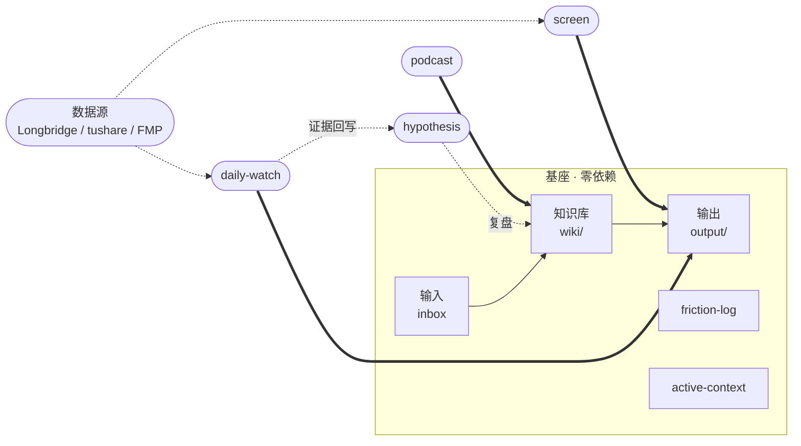

# AI Workspace Hub

> 30 秒看懂：这是一个 **all-in-one AI 研究工作系统**。
> 六大能力开箱即用——个人知识库、研究闭环、快速筛选、假设追踪、播客摄入、日报监控。
> 一次 clone，零配置能跑基座，配上免费 API 全部亮灯。

核心理念：**把 AI 研究工作拆成一条稳定链路——输入 → 知识库 → 输出 → 反馈 + 记忆，六大能力覆盖全流程。**

---

## 快速开始

**方式 A：直接 clone**

```bash
git clone https://github.com/Benboerba620/ai-workspace-hub.git my-workspace
cd my-workspace
```

用 Codex / Claude Code 打开，直接说：

> 把 `inbox/first-note.md` 整理进 personal wiki。

这条 note → wiki 链路是纯 markdown 读写，**零依赖、不联网、任何 agent 都能跑**。

**方式 B：让 AI agent 装进你的工作区**

把下面这句话发给 Codex / Claude Code / Cursor / Cline：

```text
帮我按这个协议安装 AI Workspace Hub：https://github.com/Benboerba620/ai-workspace-hub/blob/main/INSTALL-FOR-AI.md
```

Agent 读协议、问 3 个问题、建好目录写入文件——**全程零依赖、不联网、不动你的旧资料**。

---

## 最近更新

- `0.3.0`：**All-in-One 升级**——pod2wiki（播客摄入）+ daily-watchlist（日报监控）代码合并进 `tools/`；新增 screen 快速筛选；Longbridge 免费数据源接入。一次 clone 拿到全部六大能力。
- `0.2.4`：修复 INSTALL 路径试跑缺文件。
- `0.2.3`：active-context 上限自动清理。

> 完整历史见 [CHANGELOG.md](CHANGELOG.md)。

---

## 六大能力

| 能力 | 做什么 | 需要 API? | 试一下 |
|------|--------|-----------|--------|
| **wiki** | 个人知识库：材料摄入 → 结构化存储 | 否 | "把 inbox/first-note.md 整理进 wiki" |
| **research** | 研究闭环：wiki + websearch → 报告 → 回写知识库 | 否 | "帮我研究一下 {某公司}" |
| **screen** | 快速筛选：给主题 → 找候选 → 拉数据 → 排序 → Top 5 分析 | 可选 | "帮我筛选 AI 产业链的股票" |
| **hypothesis** | 假设追踪：建假设 → 收集证据 → 复盘 → 回写知识库 | 否 | "建个假设：AI 资本开支持续增长" |
| **podcast** | 播客/博客摄入：YouTube/RSS → 双语摘要 → wiki | 需 LLM key | "扫一下最近 7 天播客" |
| **daily-watch** | 日报监控：拉行情 → 检测异动 → 搜新闻 → 生成日报 | 可选 | "生成今天的盯盘日报" |

**零 key 能跑**：wiki + research + hypothesis + screen（纯 websearch 模式）不需要任何 API key。

**配上免费 key 全部亮灯**：Longbridge（港美股免费）+ tushare（A 股免费）+ 一个 LLM key（DeepSeek 等）。

---

## 数据源

| 数据源 | 市场 | 费用 | 获取方式 |
|--------|------|------|---------|
| **Longbridge** | HK + US | 免费 | [open.longbridge.com](https://open.longbridge.com/zh-CN/skill/) |
| **tushare** | A 股 (.SH/.SZ) | 免费额度 | [tushare.pro](https://tushare.pro/register) |
| **FMP** | 全球 | 免费 250 次/天 | [financialmodelingprep.com](https://financialmodelingprep.com/) |

没配 → 自动降级到 websearch，数字标 `[待验证]`，不编造。

---

## 架构



详细架构见 [ARCHITECTURE.md](ARCHITECTURE.md)。

---

## 目录结构

```text
ai-workspace-hub/
├── AGENTS.md / CLAUDE.md        # 入口：总路由（同源）
├── config/                      # 用户配置（API key 等，不入 git）
├── tools/                       # 内置工具
│   ├── podcast/                 #   播客/博客摄入
│   └── daily-watch/             #   日报监控 + 假设 + 交易
├── wiki/                        # 知识库
├── inbox/                       # 输入
├── output/                      # 输出（research/ screen/ pod2wiki/）
├── hypothesis/                  # 假设追踪
├── daily-watchlist-reports/     # 日报
├── portfolio/                   # 交易记录
├── monitoring/                  # 监控对象
├── workspace/                   # 工作记忆 + 摩擦日志
└── system/                      # 机器零件箱（skills/ integrations/ templates/）
```

---

## 第一周怎么用

| 天数 | 动作 | 目标 |
|---|---|---|
| Day 1 | clone，跑通 note → wiki | 确认基座能动 |
| Day 2 | 放入 3-5 条材料 | 测试知识库摄入 |
| Day 3 | 跑一次研究 | 测试 wiki → output |
| Day 4 | 配 Longbridge / tushare | 亮灯数据源 |
| Day 5 | 跑一次 screen 或 daily-watch | 测试工具链 |
| Day 6 | 配 LLM key，扫一次播客 | 完整闭环 |
| Day 7 | 删一条没用的规则 | 防止系统变胖 |

---

## Codex / Claude 双适配

| 层级 | Codex | Claude Code |
|---|---|---|
| 入口 | `AGENTS.md` | `CLAUDE.md`（同源） |
| 能力 | `system/skills/` | `system/skills/` |
| 工具 | `tools/` | `tools/` |
| 记忆 | `workspace/meta/` | `workspace/meta/` |

---

## active-context：断点续传

"今天停、明天接"，两条规则 agent 自动执行：

- **今天到此**：你说一句"暂停 / 明天继续"，agent 往 `active-context.md` 追一行，记下主题、状态、续接锚点。
- **明天接上**：你说"继续"，agent 读 `active-context.md`，顺着最新条目接上。

---

## 防臃肿

加功能前问三个问题：

1. 一次性的？→ 留在对话，不落盘。
2. 项目特有的？→ 写项目配置或 skill。
3. 跨项目长期有效的？→ 才写进 `AGENTS.md` / `CLAUDE.md`。

配合 `friction-log` + 每周结构体检（`system/skills/structure-health.md`），系统不会胖。

---

## 不包含什么

- 不包含 GUI
- 不绑定任何模型或数据源
- 不强制某个编辑器
- 不做自动交易

它的定位是：给 AI agent 一个可读、可写、可演化的研究工作系统。
