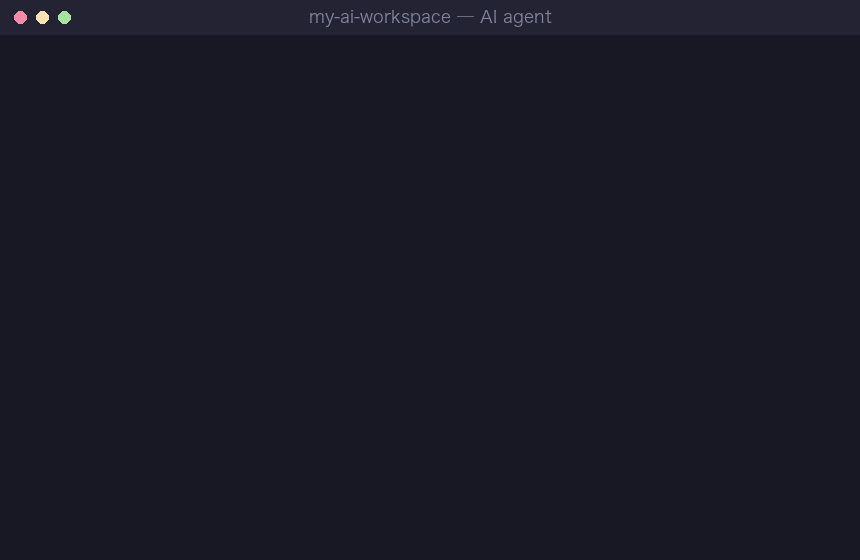
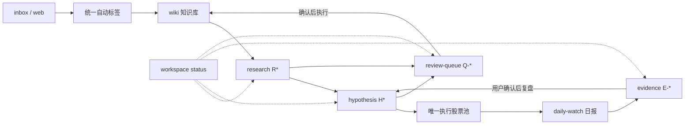

<div align="center">

# AI Workspace Hub

**Turn Codex, Claude Code, Cursor, and Cline into a persistent research workspace.**

把 AI 编程助手变成一套能长期记忆、持续研究、自动沉淀的工作台。

[](https://github.com/Benboerba620/ai-workspace-hub/actions/workflows/ci.yml)
[](https://www.python.org/downloads/)
[](https://github.com/Benboerba620/ai-workspace-hub/stargazers)
[](LICENSE)

[30 秒上手](#-30-秒上手) · [六大能力](#-六大能力) · [第一周怎么用](#-第一周怎么用) · [故障排查](TROUBLESHOOTING.md)



<sub>演示动图按安装协议与 <a href="START-HERE.md">首次股票研究流程</a>脚本化生成（<a href="docs/gen_demo_gif.py">生成脚本</a>），非实录。</sub>

</div>

---

> **最近更新（2026-08-18）**：新增可选 Obsidian 阅读台，自动汇总 inbox、研究、筛选、Podcast 和日报新内容；同时明确 daily-watch 与 podcast 已随 Hub 内置，无需单独安装。

> 对话很聪明，但工作流没有记忆；今天做完，明天又从头解释。

AI Workspace Hub 解决这个问题。六大能力开箱即用——**核心工作流不需要 API key**。

> 📖 想先了解设计思路？看作者的公众号长文：[《从0构建 AI 协作系统（一）：从最小可运行的 MVP 开始》](https://mp.weixin.qq.com/s?__biz=MzcwNTA3NjkzNQ==&mid=2247484256&idx=1&sn=8b7af107a56947b1d14b944445f19d38)

---

## ⚡ 30 秒上手

把下面这句话发给你的 AI agent（Codex / Claude Code / Cursor / Cline）：

```text
帮我按这个协议安装 AI Workspace Hub：
https://raw.githubusercontent.com/Benboerba620/ai-workspace-hub/main/INSTALL-FOR-AI.md
抓不到协议全文就先 git clone 本仓库，再读其中的 INSTALL-FOR-AI.md 逐字执行。
```

Agent 会问你 4 个问题（路径、用途、现有 wiki、是否使用 Obsidian），然后自动创建完整工作区。装好后，先用样例确认安装：

```text
把 inbox/first-note.md 整理进 personal wiki。
```

预期：agent 读 `AGENTS.md` → 按 `wiki/_schema.md` 整理 → 写入 `wiki/sources/` → 在 `active-context.md` 记录进度。

**不需要 API key，不需要联网，不需要写任何代码。**

样例通过后，开始第一份真实股票研究：

```text
研究一家公司，同时帮我建立第一版研究偏好。
公司是：____；我现在关注它是因为：____。
```

这次会同时产出研究报告、研究偏好 v0.1、可验证假设和后续跟踪指标。以后研究其他公司会复用并继续校准这套方法，而不是每次从空白开始。

<details>
<summary>还没有 AI agent？先花 2 分钟装一个</summary>

任选其一，都有免费或试用档：

- **Claude Code**（推荐）：先装 [Node.js](https://nodejs.org/)，然后终端运行 `npm install -g @anthropic-ai/claude-code`，在任意目录输入 `claude` 登录 Claude 账号。
- **Codex CLI**：`npm install -g @openai/codex`，输入 `codex` 登录 ChatGPT 账号。
- **Cursor**：去 [cursor.com](https://cursor.com) 下载安装，打开一个文件夹后用内置对话。

装好后回到上面，把那句话发给它就行。

</details>

<details>
<summary>更习惯手动 clone？</summary>

```bash
git clone https://github.com/Benboerba620/ai-workspace-hub.git my-ai-workspace
cd my-ai-workspace
```

用 AI agent 打开这个目录，直接试跑 `inbox/first-note.md → wiki`。

验证安装状态：

```bash
python3 system/scripts/check_workspace.py    # Windows: python system/scripts/check_workspace.py
```

Core Mode 显示 `READY` 即可开始使用。

</details>

---

## 📈 股票研究主流程

```text
首次研究引导 → 研究偏好 v0.1 → 研究结论 → 可验证假设
      → 跟踪指标 → daily-watch 日报 → 独立证据 → 假设复盘 → 长期知识
```

`START-HERE.md` 是安装后的用户首页。信息摄入只是输入环节；系统的主线是让研究结论进入假设，并通过日报持续验证。

每份研究、假设和证据都有稳定 ID；当前状态只保存在 Markdown frontmatter。需要用户确认的 wiki 沉淀、假设调整、股票池新增和研究偏好变化会进入持久待确认队列。直接说：

```text
看看我的研究系统现在有什么需要处理。
```

Agent 会汇总进行中的研究、待复盘证据、到期假设和待确认动作，并给出下一步。

## 🧩 六大能力

| | 能力 | 你可以怎么说 | 写入哪里 | API key |
|:--:|------|-------------|----------|---------|
| 📚 | **wiki** | "把这篇文章整理进知识库" | `wiki/` | 推荐（自动标签） |
| 🔬 | **research** | "帮我研究一下某公司 / 某行业" | `output/research/` | 不需要 |
| 🔍 | **screen** | "帮我筛选 AI 产业链股票" | `output/screen/` | 可选 |
| 📊 | **daily-watch** | "生成今天的盯盘日报" | `output/daily-watch/` + `evidence/` | 可选 |
| 🧪 | **hypothesis** | "把这个投资假设建档并追踪" | `hypothesis/` | 不需要 |
| 🎙️ | **podcast** | "扫一下这几个播客并写进 wiki" | `wiki/sources/` + `output/pod2wiki/` | 需要 LLM key |

> **daily-watch 和 podcast 已经内置在 Hub 中，不需要再单独安装。** 只有行情、自动标签、播客摘要等 Enhanced Mode 能力需要你按需填写 API key。
>
> **零 key 可用**：wiki 仍可摄入，但跳过脚本自动标签；research、hypothesis、screen（websearch 模式）、daily-watch（报告骨架 + 美股降级源）照常可用。
>
> **默认建议配置**：自己的 DeepSeek / Kimi / GLM / Qwen key 用于 wiki 自动标签和播客摘要；tushare（A 股）· FMP（全球行情）· [Longbridge Skill](https://open.longbridge.com/zh-CN/skill/)（多市场查询）按需开启。

---

## 🔄 工作流程



核心不是"文件夹长什么样"，而是：**agent 进入目录后知道先读什么、做研究时先查本地 wiki、输出时事实与推测分开、证据和判断不混写、待确认动作不会随对话消失、明天继续时能从断点接上。**

wiki 变大后也不会每次全量加载。每次研究先运行 Research Preflight：按 `rule -> pattern -> exploration` 加载相关可复用知识，同时扫描 `entities / concepts / sources`，只返回少量命中页面、命中理由和过期/冲突提示，再决定哪些问题需要联网。扫描不调用大模型，并生成可检查的回执。知识按 `source -> exploration -> pattern -> rule` 逐级提炼；每次晋级、降级或退役都保留用户确认、复审日期和失效条件。

材料进入 wiki 时由同一个打标器补齐 `domain / ticker / concepts / related / entity_salience / tags`。新材料直接写入，历史补标默认只预览；已有人工字段不会被覆盖。

### 用真实案例理解 Wiki 晋级

[产能扩张周期见顶案例](examples/knowledge-lifecycle-cycle-top/README.md) 把一条真实研究判断拆成 4 个 Source、2 个已提炼 Exploration 和 1 张 draft Pattern：光伏与锂电是产生该 Pattern 的母案例，因此不能再次冒充独立确认，`primary_confirmations` 保持为 0。日常研究默认不会加载这张草稿卡；复盘模式可以找到它，未来经过两次新的独立事前验证并由用户确认后，才允许变成 active Pattern。累计三次独立确认后，再讨论是否形成可执行 Rule。

案例目录可以独立运行 `summary` 和 `load`，仓库测试同时守住“母案例不计确认、draft 不进入日常加载、满足门槛后才可晋级”三条边界。

> 系统不在某个模型里，而在这套文件协议里。谁读懂这套协议，谁就接上你的工作流。

---

## ⚙️ Core Mode / Enhanced Mode

| 模式 | API key | 能做什么 | 适合 |
|------|---------|----------|------|
| **Core** | 不需要 | wiki 摄入（无脚本自动标签）、研究草稿、快速筛选、假设建档、断点续传 | 临时未配置 API 时 |
| **Enhanced** | 建议填写 | wiki 自动标签、播客摘要、行情日报、A 股 / 全球市场数据、自动监控 | 默认日常使用 |

推荐路径：安装后运行 `check_workspace.py` → 把自己的 LLM key 填到 `config/pod2wiki.env` → 用第一篇材料验证自动标签。暂时没有 key 时仍可先跑 Core Mode。

---

## 📅 第一周怎么用

| 天数 | 动作 | 目标 |
|:----:|------|------|
| Day 1 | 配置自己的 LLM key，跑通 `inbox/first-note.md → wiki` | 确认摘要、自动标签和分类都能工作 |
| Day 2 | 放入 3-5 条真实材料 | 建立第一批知识库 |
| Day 3 | 让 agent 研究一个公司 / 行业 | 生成第一篇结构化报告 |
| Day 4 | `check_workspace.py`，按需配 tushare / FMP | 增强行情能力 |
| Day 5 | 做一次主题筛选 | 形成候选池 |
| Day 6 | 扫一次播客 / 博客 | 建立外部信息流 |
| Day 7 | 运行结构体检，删掉没用规则 | 防止系统变胖 |

---

## 适合谁？

**适合**：投资研究员、个人投资者、内容创作者、AI power user、Markdown / Obsidian 用户、想做长期项目而不是一次性对话的人。

**不适合**：想要 GUI 应用、自动交易系统，或不愿意用 Markdown 管理知识的人。

---

<details>
<summary><b>📂 目录结构</b></summary>

```text
ai-workspace-hub/
├── AGENTS.md                 # Codex 入口路由
├── CLAUDE.md                 # Claude Code 入口路由
├── INSTALL-FOR-AI.md         # 交给 AI agent 的安装协议
├── SMOKE-TEST.md             # 冒烟测试
├── ARCHITECTURE.md           # 架构说明
├── TROUBLESHOOTING.md        # 故障排查
├── workspace/                # 配置、断点、看板与归档
│   ├── monitoring/           # 用户阅读的监控看板
│   └── archive/              # 退出主流程的历史材料
├── inbox/                    # 临时输入材料
├── wiki/                     # personal wiki（exploration / pattern / rule）
├── output/                   # 研究、筛选、播客和日报输出
│   └── daily-watch/          # 日报归档
├── hypothesis/               # 投资假设和复盘
├── evidence/                 # 独立证据账本
├── portfolio/                # 交易记录
├── config/                   # 用户配置，不入 git
├── tools/                    # podcast / daily-watch 工具
└── system/                   # skills / integrations / scripts / templates
```

</details>

<details>
<summary><b>🗄️ 数据源与边界</b></summary>

| 名称 | 类型 | 用途 | 是否内置 |
|------|------|------|----------|
| Nasdaq | 无 key 降级源 | 美股基础行情 | 是 |
| Finnhub / EOD / yfinance | 降级源 | 美股行情备选（Finnhub / EOD 需各自免费 key，yfinance 用 `ENABLE_YFINANCE=1` 开启） | 是 |
| tushare | API 数据源 | A 股行情 / 财务 | 是，需 token |
| FMP | API 数据源 | 全球行情 / 财报 / 宏观 | 是，需 key |
| Longbridge Skill | 外部 Agent 扩展 | 多市场查询、筛选、研究 | 否，独立安装授权 |
| websearch | Agent 能力 | 补充新闻、资料、公司信息 | 取决于 agent |

**重要边界**：本项目不做自动交易，不承诺数据源永远免费，不把 AI 输出包装成投资建议。缺少 API key 时优雅降级，不会让用户误以为工作区坏了。

</details>

<details>
<summary><b>💻 常用命令</b></summary>

```bash
python3 system/scripts/check_workspace.py          # 总检查
python3 system/scripts/workspace_status.py         # 当前研究、证据和待办
python3 system/scripts/research_preflight.py --root . --context "你的研究问题和关键词" --research-id R-... --research-file output/research/报告.md --record  # 扫描 Wiki 并更新研究报告
python3 system/scripts/knowledge_lifecycle.py --root . summary  # 知识状态、到期复审和晋级候选
python3 system/scripts/knowledge_lifecycle.py --root . rebuild-index --apply  # 重建三个短索引
python3 system/scripts/review_queue.py list        # 查看持久待确认队列
python3 system/scripts/wiki_tagger.py --root . backfill wiki  # 预览历史 wiki 补标
python3 -m unittest discover -s tests -v            # 运行测试
python3 tools/daily-watch/scripts/check_setup.py --init  # 初始化日报配置
python3 tools/podcast/scripts/fetch_podcasts.py --help   # 播客工具帮助
```

Python 工具需要 3.10+。**Windows 用户**用 `python` 代替 `python3`，或 `py -3` 指定版本。

</details>

<details>
<summary><b>❓ 新手常见问题</b></summary>

**Q：我不会写代码，能用这个项目吗？**
可以。Core Mode 只需要把文本放进 `inbox/`，然后用自然语言告诉 AI agent 做什么。

**Q：一定要用 Codex / Claude Code 吗？**
不一定。任何能读写文件的 AI agent 都可以。Codex 和 Claude Code 效果最好，Cursor 和 Cline 也可以。

**Q：安装 Hub 后，还要单独安装 daily-watchlist 或 pod2wiki 吗？**
不需要。两套工具及其配置模板已经包含在 `tools/daily-watch/` 和 `tools/podcast/`；你只需要按用途配置自己的 API key 或可选依赖。

**Q：wiki 越来越大怎么办？**
用 Obsidian 打开 `wiki/` 目录做可视化管理，或让 AI agent 帮你整理归档。

**Q：API key 会不会泄露？**
`config/` 已被 `.gitignore` 排除，不会被 git 提交。

**Q：自动标签会把什么发给大模型？**
会把当前 wiki 页面的 frontmatter 和正文发送给你在 `config/pod2wiki.env` 选择的模型服务商，只用于返回结构化标签。敏感材料应先确认所选服务商的数据政策，或跳过自动标签。

**Q：可以和 Obsidian 一起用吗？**
可以。安装时选择 Obsidian（或在已有 vault 中安装），Hub 会增加 `reading-hub.md` 和 `reading-hub.base`，用 9 个动态视图汇总待读内容；默认不安装，也不影响非 Obsidian 用户。需要 Obsidian 1.9+ 的 Bases 功能。

更多问题见 [TROUBLESHOOTING.md](TROUBLESHOOTING.md)。

</details>

---

## Roadmap

- 更多真实研究工作流样例
- 更强的 screen 预设
- 更完善的 daily-watch 降级策略
- 证据来源质量分级和跨来源事件去重
- 知识索引的自动健康检查与过期提示

---

## Contributing

欢迎提 issue / PR，尤其是新 agent 适配、研究报告模板、数据源接入、真实使用摩擦点、README / 教程 / 安装流程改进。

---

## Star History

如果这个项目对你有帮助，欢迎点一下 ⭐ Star。它会帮助更多需要"长期 AI 工作流"的人发现这个项目，也会让我知道哪些方向值得继续做。

[](https://www.star-history.com/#Benboerba620/ai-workspace-hub&Date)

---

## Disclaimer

AI Workspace Hub 是个人研究与知识管理工具，不构成投资建议。所有市场数据、公司信息、财务数字、新闻和监管信息都应以原始来源为准。

<!-- 文件说明：项目首页、价值介绍和快速上手。 -->
