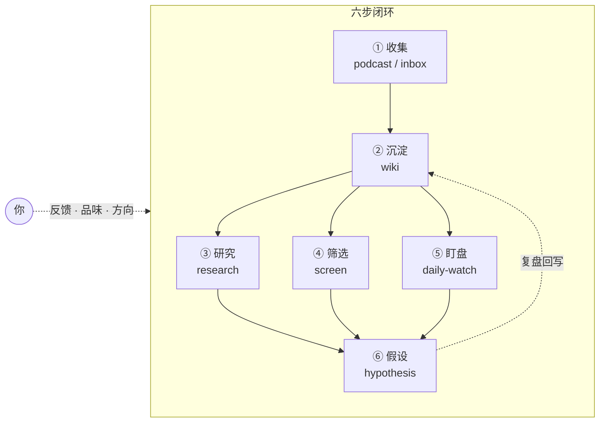

# AI Workspace Hub

> 一套 all-in-one 的 AI 研究工作系统。一次 clone，六大能力开箱即用。

一个研究员每天干的事，说穿了就六步：

1. **收集材料**——播客、研报、纪要、博客，什么都往里塞
2. **沉淀知识**——把零散材料整理成结构化的知识库
3. **做研究**——带着问题翻知识库、查网上的、写出结论
4. **筛选标的**——给个方向，快速扫一圈值得跟的标的
5. **日常盯盘**——每天看异动、查原因、盯假设有没有被证伪
6. **追踪假设**——把投资逻辑写下来，收集证据，定期复盘

这套系统就是把这六步变成 AI 能跑的闭环。每一步对应一个能力，全部内置、零配置能跑基座，配上免费 API 全部亮灯。

---

## 快速开始

```bash
git clone https://github.com/Benboerba620/ai-workspace-hub.git my-workspace
cd my-workspace
```

用 Codex / Claude Code 打开，直接说：

> 把 `inbox/first-note.md` 整理进 personal wiki。

这条 note → wiki 链路纯 markdown 读写，**零依赖、不联网、任何 agent 都能跑**。这就是那个"先跑起来"的最小起点。

> 想装进已有的工作区？把这句话发给 AI agent：`帮我按这个协议安装 AI Workspace Hub：https://github.com/Benboerba620/ai-workspace-hub/blob/main/INSTALL-FOR-AI.md`

---

## 六步 × 六大能力

| 工作流 | 能力 | 做什么 | 需要 API? |
|--------|------|--------|-----------|
| ① 收集材料 | **podcast** | YouTube/RSS/博客 → 双语摘要 → wiki | 需 LLM key |
| ② 沉淀知识 | **wiki** | 材料摄入 → 按 schema 分类存储 | 否 |
| ③ 做研究 | **research** | wiki + websearch → 结构化报告 → 回写知识库 | 否 |
| ④ 筛选标的 | **screen** | 给主题 → 找候选 → 拉数据 → Top 5 分析 | 可选 |
| ⑤ 日常盯盘 | **daily-watch** | 拉行情 → 检测异动 → 搜新闻 → 生成日报 | 可选 |
| ⑥ 追踪假设 | **hypothesis** | 建假设 → 收集证据 → 复盘 → 回写知识库 | 否 |

**零 key 能跑**：wiki + research + hypothesis + screen（纯 websearch 模式）不需要任何 API key。

**配上免费 key 全部亮灯**：[Longbridge](https://open.longbridge.com/zh-CN/skill/)（港美股免费）+ [tushare](https://tushare.pro/register)（A 股免费）+ 一个 LLM key（[DeepSeek](https://platform.deepseek.com/) 等）。

---

## 系统就两样东西

说穿了，这套系统就两样东西：**一份路由文档 + 一套文件夹结构**。

文件夹是骨架，规定每样东西往哪儿放；路由文档是大脑——它告诉 AI：看到"摄入""研究""盯盘"这些信号，分别去读哪个文件、按什么规则干。路由按 AI 分：Codex 读 `AGENTS.md`、Claude 读 `CLAUDE.md`，两份内容同源，指向同一套配置。

> 系统不在 agent 里，在文件协议里——谁来读这套文件夹，谁就接上了。

```text
ai-workspace-hub/
├── AGENTS.md            # 路由文档：Codex 读这份
├── CLAUDE.md            # 路由文档：Claude 读这份（与 AGENTS.md 同源）
├── workspace/
│   ├── workspace-config.md   # 项目配置 + 数据源登记（每次必读）
│   └── meta/
│       ├── active-context.md # 工作记忆：当前在做什么，明天从哪接
│       └── friction-log.md   # 摩擦日志：哪里卡住了，用来改流程
│
├── inbox/                    # 临时丢进来的原始材料
├── wiki/                     # 结构化知识库（来源 / 公司 / 概念 / 结论）
├── output/                   # 研究报告、筛选结果等输出
├── daily-watchlist-reports/  # 每日监控日报
├── hypothesis/               # 投资假设 + 证据 + 复盘
├── monitoring/               # 股票池、关注对象
├── portfolio/                # 交易记录
│
├── config/                   # 用户配置：API key 等（不入 git）
├── tools/
│   ├── podcast/              # 播客 / 博客摄入脚本
│   └── daily-watch/          # 日报监控 + 行情拉取脚本
├── system/
│   ├── skills/               # 能力说明书：每个能力怎么用
│   ├── integrations/         # 内部接线：工具和知识库怎么连
│   └── templates/            # 安装时复制的模板文件
└── requirements.txt          # Python 依赖（首次用工具时装）
```

---

## 闭环怎么转



研究、筛选、盯盘的产出喂进假设，假设复盘后回写知识库——闭环就在这接上了。**但闭环里最关键的一环是你**：你对 AI 产出的评价、追问、方向调整，才是系统进化的驱动力。

---

## 数据源

| 数据源 | 市场 | 费用 | 获取方式 |
|--------|------|------|---------|
| **Longbridge** | HK + US | 免费 | [open.longbridge.com](https://open.longbridge.com/zh-CN/skill/) |
| **tushare** | A 股 (.SH/.SZ) | 免费额度 | [tushare.pro](https://tushare.pro/register) |
| **FMP** | 全球 | 免费 250 次/天 | [financialmodelingprep.com](https://financialmodelingprep.com/) |

没配 → 自动降级到 websearch，数字标 `[待验证]`，不编造。

---

## 第一周怎么用

| 天数 | 动作 | 对应工作流 |
|---|---|---|
| Day 1 | clone，跑通 note → wiki | ①② 收集 + 沉淀 |
| Day 2 | 放入 3-5 条材料，整理进知识库 | ①② 收集 + 沉淀 |
| Day 3 | "帮我研究一下 {某公司}" | ③ 做研究 |
| Day 4 | 配 Longbridge / tushare | 亮灯数据源 |
| Day 5 | "帮我筛选 AI 产业链的股票" | ④ 筛选标的 |
| Day 6 | 配 LLM key，扫一次播客 | ① 收集（进阶） |
| Day 7 | 删一条没用的规则 | 防止系统变胖 |

---

## 断点续传

"今天停、明天接"，agent 自动执行：

- **今天到此**：你说"暂停 / 明天继续"，agent 往 `active-context.md` 追一行，记主题、状态、续接锚点。
- **明天接上**：你说"继续"，agent 读 `active-context.md`，顺着最新条目接上。

---

## 别让它乱长

加功能前问三句：

1. 一次性的？→ 留在对话，不落盘。
2. 项目特有的？→ 写项目配置或 skill。
3. 跨项目长期有效的？→ 才写进 `AGENTS.md` / `CLAUDE.md`。

系统用久了一定会膨胀。context 即智能——配置越胖、模型越笨。所以得定期清理，让模型自己检查、自己清，你当监工就行（`system/skills/structure-health.md`）。

---

## 不包含什么

- 不包含 GUI、不绑定模型或数据源、不强制编辑器、不做自动交易。
- Codex 和 Claude Code 都能用——系统在文件协议里，不在 agent 里。

> 系列文章：[从零构建 AI 协作系统（一）：从最小可运行的 MVP 开始](https://mp.weixin.qq.com/s/YOUR_LINK)

*声明：本文提到的工具均为个人使用，非推广。投资有风险，AI 工具不构成投资建议。*
