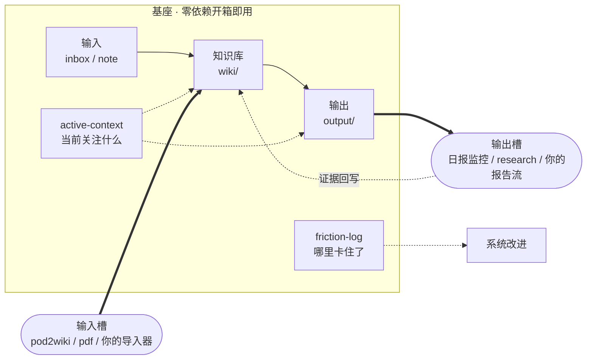

# AI Workspace Hub

> 30 秒看懂：这是一个 **Codex-first、Claude-compatible** 的最小 AI 工作系统**基座**。
> 它把任何 AI 工作（研究 / 写作 / 投研 / 个人知识库）拆成一条稳定的链路——
> **输入 → 知识库 → 输出 → 反馈 + 记忆**——然后在两侧预留槽位，想要更多就插模块。

核心理念：**不是给你一个完整系统，而是给你一颗能跑的最小种子 + 一套演化规则。系统应该从你的真实工作里长出来。**

它的形状只有两层：

- **基座**：开箱即用，零依赖。只要有 Codex / Claude，clone 下来立刻能跑。
- **槽位**：基座之外的能力和模块，全部"想要才加，喊一句 agent 自己装"。

---

## 🚀 快速安装

把下面这句话发给 **Codex / Claude Code / Cursor / Cline**，它会自动把基座装进你的工作区（读 INSTALL → 只问 3 个问题 → 建目录写文件，**全程零依赖、不联网、不动你的旧资料**）：

```text
帮我按这个协议安装 AI Workspace Hub：https://github.com/Benboerba620/ai-workspace-hub/blob/main/INSTALL-FOR-AI.md
```

> 想先零成本试跑本 repo，或手动 `git clone` 当模板？往下看 [安装到你自己的工作区](#安装到你自己的工作区)。

---

## 最近更新

- `0.2.0`：新增 research 研究闭环（wiki + websearch + 可选数据源 → 模板输出 → 确认后回写 wiki）；机械零件收进 `system/`，顶层目录 13→8；新增 ARCHITECTURE.md。
- `0.1.0`：首个 Codex-first / Claude-compatible 最小基座（personal wiki + first-ingest + PDF smoke path）。

> 完整历史见 [CHANGELOG.md](CHANGELOG.md)。

---

## 直接试跑（基座，零依赖）

这个 repo 本身就是一个最小可运行 workspace。用 Codex 或 Claude 打开本目录，直接说：

> 把 `inbox/first-note.md` 整理进 personal wiki。

预期结果：

1. agent 读取 `AGENTS.md`（Codex）或 `CLAUDE.md`（Claude）、`workspace/workspace-config.md`、`wiki/_schema.md`、`system/integrations/personal-wiki.md`。
2. 把 `inbox/first-note.md` 整理成 `wiki/sources/YYYY-MM-DD-first-note.md`。
3. 更新 `workspace/meta/active-context.md`。
4. **全程不联网、不装任何依赖、不需要 pod2wiki / daily-watchlist。**

这条 note → wiki 链路是纯 markdown 读写，**在任何系统、任何 agent 上都能直接跑**。这就是基座给你的"5 分钟，它真的动了"。

---

## 安装到你自己的工作区

试跑满意后，把基座装进你自己的项目目录。两种方式：

**A. 让 AI agent 自动装（推荐）** —— 把下面这句话发给 Codex / Claude Code / Cursor / Cline：

> 帮我按这个协议安装 AI Workspace Hub：https://github.com/Benboerba620/ai-workspace-hub/blob/main/INSTALL-FOR-AI.md

agent 会读 [INSTALL-FOR-AI.md](INSTALL-FOR-AI.md)、只问你 3 个问题（放哪、主要用途、是否已有 wiki），然后建好最小目录、写入核心文件——**全程不装依赖、不联网、不复制你的旧资料**。

**B. 直接 clone 当模板**

```bash
git clone https://github.com/Benboerba620/ai-workspace-hub.git my-workspace
cd my-workspace
```

用 Codex / Claude 打开本目录即可开工；想精简成纯净起点，照 [INSTALL-FOR-AI.md](INSTALL-FOR-AI.md) 删掉示例内容。

> 装好、试跑几次、不再需要上手引导后，说一句"精简系统"，agent 会清掉安装脚手架、把每次必读的文件压薄（见 `system/skills/post-install-cleanup.md`）。

---

## 想要更多：喊一句，agent 自己装

基座之外的一切都是可选的，**不预装、不预配环境**。你想用某个能力时对 agent 说一句，它读对应说明、自己装依赖、然后干活。

以 PDF 摄入为例（基座自带的第一个、也是样板能力）：

> 帮我开启 PDF 摄入，把 `inbox/sample-ai-workspace.pdf` 整理进 wiki。

agent 会：读 `system/skills/pdf-ingest.md` → 自检 Python、`pip install pypdf` → 跑 `python system/scripts/pdf_to_md.py` → 按 schema 摄入。装一次即可长期复用。

> PDF 能力处理文本型 PDF；扫描件 / 双栏研报 / 表格需要接 OCR / MinerU 等专业工具。

同理，官方模块也是"喊一句就装"。安装基座时 agent 会主动问你要不要装**博客 / 播客抓取**和**日报监控**；当时不装也行，以后随时说：

> 帮我安装博客抓取。　／　帮我安装日报监控。

agent 会 `git clone` 对应 repo、按文件契约接线、把它的输入 / 输出连进 `wiki/`，连成一个系统（见 `system/skills/deploy-modules.md`）。

---

## 研究闭环（基座自带，零依赖起步）

知识库装进材料之后，可以直接做研究——这是基座自带的输出能力，核心只用 `wiki/` + websearch，不必装任何东西：

> 帮我研究一下 {某公司 / 行业 / 问题}。

agent 会（见 `system/skills/research.md`）：**先查 `wiki/` 已有结论（含矛盾扫描）→ 联网补充 → 按研究要点模板写到 `output/research/`**，每个事实标来源（`[本地]` / `[网页]` / `[推测]` / `[待验证]`）。你接着追问、挑战、深挖，它持续更新同一份报告；告一段落时它会问一句"**要把这次研究 + 讨论结论沉淀进 wiki 吗？**"——你点头，跨来源判断进 `wiki/explorations/`、新对象进 `wiki/entities/`，闭环回到知识库。

想接自己的数据源（tushare / gangtise / 自有 API）？在 `workspace-config` 的 `data_sources:` 段登记一行、key 走环境变量即可；没配的数字 agent 会标 `[待验证]` 而不是编造。

---

## 架构：基座五件套 + 两类槽位



### 基座五件套（都在 repo 里，开箱即用）

| 模块 | 目录 | 作用 |
|---|---|---|
| 输入 | `inbox/` | 临时丢进来的原始材料：网页、笔记、转录 |
| 知识库 | `wiki/` | 沉淀结构化来源、实体、概念、探索结论 |
| 输出 | `output/` | 日报、研究报告、写作草稿、摘要 |
| 反馈 | `workspace/meta/friction-log.md` | 记录 AI 执行中的摩擦、绕路、错误 |
| 记忆 | `workspace/meta/active-context.md` | 当前在做什么、下次从哪接（≤50 行滚动） |

### 两类槽位（想要才插）

| 槽位 | 干什么 | 自带样板 | 你可以 DIY |
|---|---|---|---|
| **输入槽** | 把外部材料变成 `wiki/` 可读输入 | pdf-ingest、pod2wiki | 接自己的爬虫 / 导入器 |
| **输出槽** | 消费知识库产出报告，可回写证据 | research（基座自带）、daily-watchlist | 接自己的写作 / 报告流 |

**关键：接现成项目和自己 DIY 长一模一样**——都是 `system/skills/{名}.md`（怎么用 + 怎么自装）+ 可选 `system/scripts/` + 在 `workspace-config` 登记一行。所以下面那些 `output/`、`monitoring/`、`hypothesis/` 目录现在是空的，它们**不是没做完的功能，就是等你插东西的槽**。

---

## 怎么扩展（DIY 或接现成项目）

照着模板抄，两类各一份：

- 加一个**能力**（住在本 repo、带脚本、agent 自装依赖，如 PDF）→ 复制 `system/skills/_template.md`，范例 `system/skills/pdf-ingest.md`。
- 接一个**外部模块**（独立项目，靠文件契约连进来，如 pod2wiki）→ 复制 `system/integrations/_template.md`，范例 `system/integrations/pod2wiki.md`。

下面几个**官方模块**已填好契约，可一键部署（说"帮我安装{名}"，见 `system/skills/deploy-modules.md`）；它们同时也是你照抄自建模块的参照：

| 项目 | 槽位 | 一键部署 | 文件契约 |
|---|---|---|---|
| [karpathy-claude-wiki](https://github.com/Benboerba620/karpathy-claude-wiki) | 知识库底座 | 默认核心 | 提供 `wiki/` schema 和 ingest 规则 |
| [pod2wiki](https://github.com/Benboerba620/pod2wiki) | 输入槽 | "帮我安装博客抓取" | 把播客 / RSS / 博客写入 `wiki/sources/`、`wiki/raw/podcasts/` |
| [daily-watchlist](https://github.com/Benboerba620/daily-watchlist) | 输出槽 | "帮我安装日报监控" | 读股票池，写日报到 `output/`，证据回写 `hypothesis/` |
| [hypothesis-tracker](https://github.com/Benboerba620/hypothesis-tracker) | 决策层 | "帮我安装假设追踪" | 读写 `hypothesis/`，复盘结论沉淀 `wiki/explorations/` |

接满之后能跑出的一条完整闭环（可选，不是基座必需）：

```text
pod2wiki → wiki → daily-watchlist → output/today → hypothesis → wiki
```

---

## Codex / Claude 双适配

底层文件协议保持一致，入口层按工具适配。**不要把系统写死在某个 agent 里；把系统写进文件协议里。**

| 层级 | Codex | Claude Code | 说明 |
|---|---|---|---|
| repo 级指令 | `AGENTS.md` | `CLAUDE.md` | 两者**同源**，改一个同步另一个 |
| 任务流程 | `system/skills/` | `system/skills/`（或复制到 `.claude/skills/`） | 公开 repo 放通用 `system/skills/` |
| 能力自装 | 自然语言触发 | 自然语言触发 | 安装逻辑写在 skill 里，工具无关 |
| 短期记忆 | `workspace/meta/active-context.md` | 同左 | 工具无关 |
| 反馈日志 | `workspace/meta/friction-log.md` | 同左 | 工具无关 |
| 外挂模块 | `system/interfaces/README.md` | 同左 | 都通过文件契约连接 |

---

## active-context：短期工作记忆

`active-context.md` 不是长期记忆，也不是历史档案。它只回答一个问题：

> 当前最值得 AI agent 继续记住的上下文是什么？

建议保留最近 1-2 周，单条一行：

```markdown
- **2026-06-05：xxx 研究（PAUSED）** -> 已完成 A；下一步确认 B。
```

## friction-log：记录摩擦，不记录情绪

`friction-log.md` 记录"系统哪里卡住了"，不是"谁做错了"。

```markdown
## 2026-06-05

- **场景**：AI 生成输出时漏读了某个上游文件
- **摩擦**：输出和知识库脱节
- **原因判断**：流程没有显式读取该目录
- **改法**：把该目录加入对应 skill 的加载规则
- **范围**：项目级，不改 `AGENTS.md` / `CLAUDE.md`
```

---

## 防臃肿：加功能前的三个问题

这是基座最重要的纪律——种子能长大，靠的是它不乱长。每次想把新要求写进系统前，先问：

1. 这是一次性的吗？是 → 留在当前对话，不落盘。
2. 这是这个项目特有的吗？是 → 写进项目配置或 skill。
3. 这是跨项目长期有效的吗？是 → 才写进 `AGENTS.md` / `CLAUDE.md`。

配合 `friction-log` 和"先删再加"的习惯，系统才不会一两周就胖到没人维护。两个内置 skill 让这条纪律可执行：

- **装好上手后**说一句"精简系统"→ `system/skills/post-install-cleanup.md` 清掉安装脚手架、瘦身每次必读的文件。
- **之后每周**说一句"结构体检"→ `system/skills/structure-health.md` 扫必读文件和目录结构，给精简建议（排程方式见 skill，建议自己挂一个每周任务）。

---

## 第一周怎么用

| 天数 | 动作 | 目标 |
|---|---|---|
| Day 1 | clone，跑通基座试跑 | 确认 note → wiki 能动 |
| Day 2 | 放入 3-5 条原始材料 | 测试输入 → 知识库 |
| Day 3 | 生成第一份输出 | 测试知识库 → 输出 |
| Day 4 | 喊一句开启一个能力（如 PDF） | 测试"按需自装" |
| Day 5 | 记录第一条 friction | 测试反馈闭环 |
| Day 6 | 删除一条没用上的规则 | 防止系统过早变胖 |
| Day 7 | 只挑最痛的一个点改 | 让系统从真实工作里长 |

---

## 推荐目录

```text
my-ai-workspace/
├── AGENTS.md / CLAUDE.md        # repo 级指令，同源
├── SMOKE-TEST.md
├── workspace/
│   ├── workspace-config.md
│   └── meta/{active-context,friction-log}.md
├── wiki/                        # 知识库：_schema + raw/sources/entities/concepts/explorations
├── inbox/                       # 输入
├── output/                      # 输出
├── monitoring/ · hypothesis/    # 输出槽预留
├── requirements-pdf.txt         # 可选能力(pdf)依赖
└── system/                      # 机器零件箱（日常不用直接读）
    ├── skills/                  #   能力（含 _template.md）
    ├── integrations/            #   外部模块契约（含 _template.md）
    ├── interfaces/              #   模块总览
    ├── scripts/                 #   可选能力的脚本
    └── templates/               #   安装时复制的核心文件
```

---

## 不包含什么

- 不包含完整投研系统、不包含 GUI
- 不绑定任何模型或数据源、不强制某个编辑器
- 不预装任何依赖（能力按需自装）

它的定位是：给 AI agent 一个可读、可写、可演化的工作基座。
